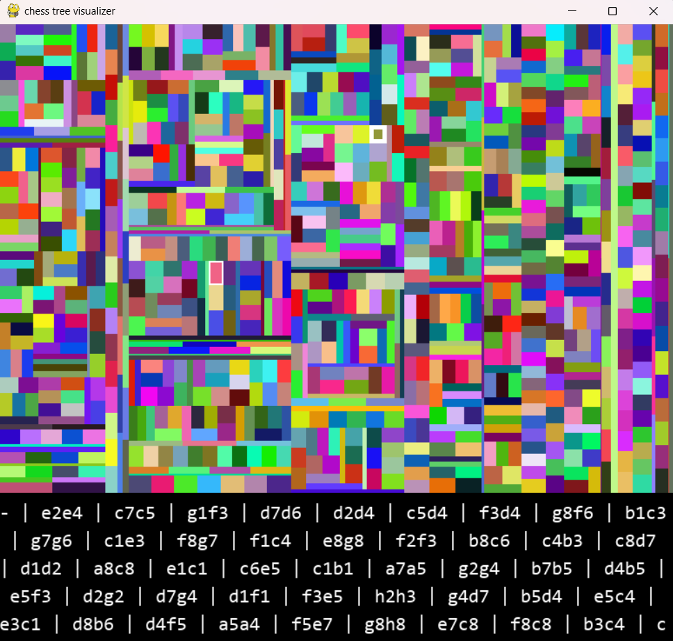
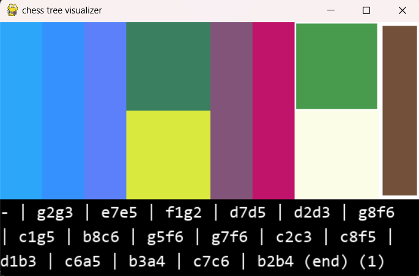
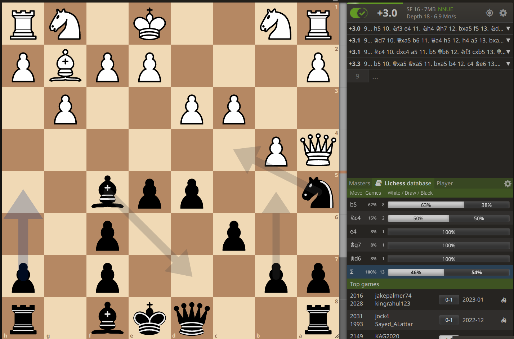

Coding Project for school visualizing the moves of various master chess games found on Lichess.com that result in specific positions (nodes). 

Here is an example of the visualization of a node which is accessed with the corresponding move order showed below. All the smaller rectangles correspond to different move continuations:

Here is a simpler example of only 10 master games, and if we go over the last game, it is the final node (since none of the games have ovverlapping moves) and if we click on it, we can see the final position. Yes, this was an official master game that lasted 9 moves.

Clicking on the last node:

